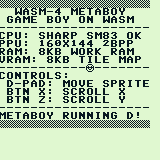
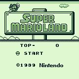
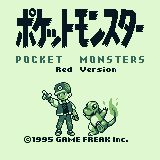
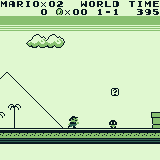

# WASM-4 MetaBoy

🎮 **Live Demo / Web Player:** [https://klknn.github.io/wasm4-metaboy/](https://klknn.github.io/wasm4-metaboy/)

A Game Boy (DMG) emulator written in the **D language** targeting the **WASM-4** fantasy console (WebAssembly).

The emulator fits completely within WASM-4's strict **64 KB** linear memory and **64 KB** cartridge size limits (compiling to just **~34.8 KB**), while emulating the Sharp SM83 CPU at 60 FPS (4.19 MHz / 70,224 cycles per frame). See [Binary Size Optimization](docs/binary_size_optimization.md) for how this was achieved.

<p align="center">
  
  &nbsp;&nbsp;
  
  &nbsp;&nbsp;
  
</p>

## Architecture

- **CPU (`source/gb/cpu.d`)**: Complete Sharp SM83 (LR35902) instruction set:
  - Registers implemented cleanly with `std.bitmanip.bitfields` for flags and 16-bit register pairs
  - 8-bit & 16-bit loads, arithmetic, and logic (including `DAA`)
  - Jumps, calls, returns, stack operations, and flag calculation (`Z`, `N`, `H`, `C`)
  - Full CB-prefix instruction table (all 256 instructions: bit manipulation, rotates, and shifts)
  - Interrupt handling with priority vectors (`VBlank`, `STAT`, `Timer`, `Serial`, `Joypad`)
- **MMU (`source/gb/mmu.d`)**: Game Boy memory bus & MBC1 banking:
  - Cartridge ROM Banking (MBC1, supporting up to 2MB ROM, 16KB banked at 0x0000..0x3FFF and 0x4000..0x7FFF)
  - Cartridge RAM Banking (MBC1, 4 banks of 8KB at 0xA000..0xBFFF, RAM enable/disable)
  - VRAM (0x8000 - 0x9FFF, 8 KB)
  - Work RAM (0xC000 - 0xDFFF, 8 KB) + Echo RAM (0xE000 - 0xFDFF)
  - OAM (0xFE00 - 0xFE9F, 160 bytes)
  - High RAM (0xFF80 - 0xFFFE, 127 bytes)
  - Hardware I/O registers (Joypad, Timer, PPU, Serial debug output, OAM DMA)
- **PPU (`source/gb/ppu.d`)**:
  - Scanline-accurate rendering (154 scanlines, Mode 2 OAM -> Mode 3 Transfer -> Mode 0 HBlank -> Mode 1 VBlank)
  - Background tilemap (32x32) with unsigned/signed tile addressing
  - Window layer display
  - Sprites (OBJ) with priority and flipping
  - Direct 2bpp blitter to WASM-4's 160x160 framebuffer at address `0x00A0`
- **Timer (`source/gb/timer.d`)**:
  - Cycle-accurate divider (`DIV` at 0xFF04) and programmable timer (`TIMA`, `TMA`, `TAC`)
- **APU (`source/gb/apu.d`)**:
  - 4-channel Game Boy sound synthesis mapped to WASM-4's `w4.tone()` audio engine:
    - **Channel 1 (Pulse 1)**: Square wave with 4 duty cycles (12.5%, 25%, 50%, 75%), frequency sweep, and volume envelope
    - **Channel 2 (Pulse 2)**: Square wave with volume envelope
    - **Channel 3 (Wave)**: Custom waveform channel mapped to WASM-4 Triangle wave
    - **Channel 4 (Noise)**: LFSR noise generator for drums, percussion, and sound effects
    - **Master Controls (`NR50`, `NR51`, `NR52`)**: Stereo panning (left/right/center) and power management
- **Built-in Debug ROM (`source/gb/rom.d`)**:
  - A custom SM83 machine-code debug program that tests:
    - Stack pointer setup & interrupts
    - Palette configuration (`BGP`, `OBP0`, `OBP1`)
    - VRAM tile loading (custom 8x8 font and sprite patterns)
    - Tilemap population at 0x9800
    - OAM sprite attribute setup
    - Real-time Joypad polling:
      - **D-Pad**: Moves the smiley face sprite in real time
      - **Button X** (GB Button A): Scrolls the background horizontally (`SCX`)
      - **Button Z** (GB Button B): Scrolls the background vertically (`SCY`)

## Controls

| Game Boy | WASM-4 Gamepad | Keyboard / Mouse |
|---|---|---|
| D-Pad | D-Pad (Up, Down, Left, Right) | Arrow Keys |
| Button A | Gamepad 1 Button 1 | `X`, `V`, `Space` |
| Button B | Gamepad 1 Button 2 | `Z`, `C` |
| Select | Gamepad 2 Button 1 | `A`, `Q`, or Right Click |
| Start | Gamepad 2 Button 2 | `Shift`, `Tab`, Left Click, or `X`+`Z` |

## Loading Commercial / Custom ROMs

MetaBoy supports commercial MBC1 cartridges (e.g. Super Mario Land, Pokémon Red) and ROM-only games (Tetris, Flappy Boy, etc.):
- **One-Click Online Demos**: In the web player, click **Play FlappyBoy** or **Play Tobu Tobu Girl** to fetch legal, open-source homebrew games directly over HTTPS without storing ROMs in this repo!
- **URL Parameter (`?rom=...`)**: Load any CORS-enabled online `.gb` ROM via HTTPS query string:
  - `?rom=flappyboy` (loads open-source [FlappyBoy](https://github.com/bitnenfer/flappy-boy-asm))
  - `?rom=tobutobugirl` (loads open-source [Tobu Tobu Girl](https://github.com/SimonLarsen/tobutobugirl))
  - `?rom=https://your-host.com/tetris.gb` (loads your personal legal backup)
- **Drag & Drop**: Simply drag and drop any `.gb` file onto the browser window running `index.html`.
- **Auto-Load**: If `pokemon_red.gb` or `super_mario_land.gb` is placed alongside `index.html`, `index.html` loads it automatically at startup.

<p align="center">
  
</p>

## Building & Running

### Prerequisites

- [LDC](https://github.com/ldc-developers/ldc) (LLVM D Compiler) with WebAssembly target support
- [WASM-4 CLI](https://wasm4.org) (`npm install -g wasm4` or `w4`)

### Build Cartridge

```shell
make build
# or dub build --arch wasm32-unknown-unknown-wasm --build release
```

This compiles `cart.wasm` (approx. 37 KB).

### Run in WASM-4

```shell
make run
# or w4 run cart.wasm
```

### Bundle to Standalone HTML

```shell
make bundle
# or w4 bundle cart.wasm --html index.html
```

You can open the generated `index.html` in any modern web browser to play immediately.

### Run Native Test Suite

Run the unit tests natively on your host machine:

```shell
make test
```

Verifies CPU registers, ALU operations, CB bitwise instructions, PPU timing, and debug ROM execution.

### Run Hardware Test ROMs (Blargg)

MetaBoy includes automated validation using Shay Green's (Blargg) Game Boy hardware test suite from [retrio/gb-test-roms](https://github.com/retrio/gb-test-roms):

```shell
make test-blargg
# or make test-all to run both unit tests and hardware ROM tests
```

This clones the test ROMs on demand into `tests/gb-test-roms/` and verifies all 11 CPU instruction tests plus instruction timing (100% pass rate: 12/12).
